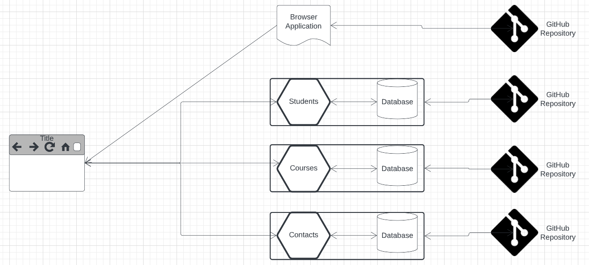
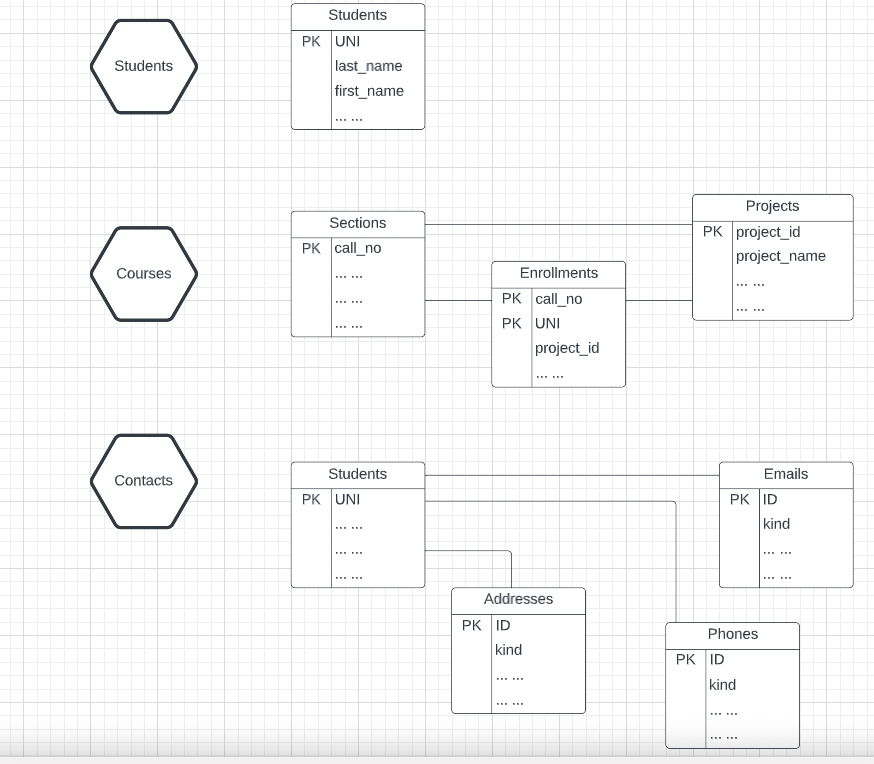
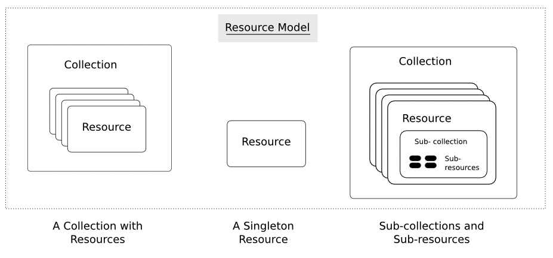
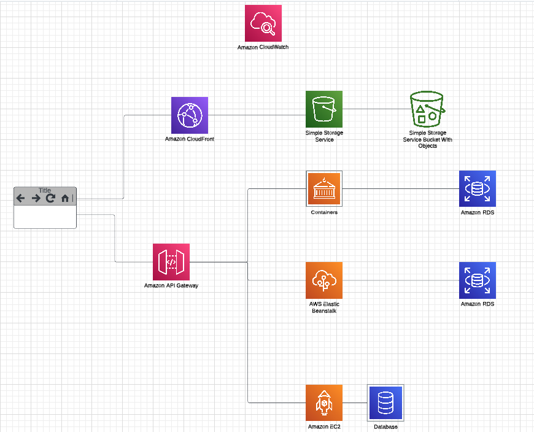

<center>
<b>
<span style="font-size: 32pt; line-height:1.2"> 
E6156 - Topics in SW Engineering: <br>Cloud Computing (F22)
</span>
</b>
</center>


# Project Sprint 1 Definition

## Overview

The goal of _sprint 1_ is to develop and deploy the core of a cloud application comprised of 
several microservices. Subsequent sprints will add capabilities to the core microservices. Following
sprints will also add additional microservices and use additional cloud capabilities.

The document uses Professor Ferguson's project for an example. Students must implement the
course requirements the sprint defines but may choose their own application scenario. Professor
Ferguson's sample application manages:
- Student enrollment in Prof. Ferguson's classes.
- Course project definitions, descriptions and teams.
- Contact preferences for students in the classes.

Students may choose other application scenarios, e.g. online commerce, social collaboration, ...

## Basic Structure


|  |
|:---:|
| __Sprint 1 Application Components__ |

Sprint 1 requires four application artifacts. 
- Three microservices, each encapsulating a database.
- One browser application (i.e. HTML, CSS, Angular/React, ... ...)

Professor Ferguson's application will implement the following resource model.

|  |
|:------------------------------:|
|  __Sprint 1 Resource Model__   |

The resource model defines the [logical abstractions](https://restfulapi.net/) that the microservices expose. The actual
data model and implementation may be, and probably is, different. The diagram only shows some
of the properties/attributes of the resources. The resources are "collections" that contain
individual resources, similar to how relational database tables contain rows.

|    |
|:-----------------------------:|
| [Collections and Resources](https://restful-api-design.readthedocs.io/en/latest/resources.html) |

In addition to the microservices, there is a simple browser/web application. The application
uses HTML, CSS, images, JavaScript/TypeScript, etc. to implement a user interface for
basic interaction with the resources.

This is not a UI/UX design and implementation course. UI/UX
is a complex domain and there are other courses that focus on the topic. The primary focus of
the inclusion of UIs in the course is helping you understand:
- How the pieces of a cloud application fit together.
- How to provision and deploy the application's components on a cloud infrastructure.

The UI/UX application should support the following functions for interacting with the
resource model.
- Retrieve a resource:
  - By ID/primary key.
  - By a query string. The UI should support [pagination](https://support.smartbear.com/qacomplete/docs/developer/api/rest/api/reference/paging.html) through result sets.
- Create a new resource in a collection.
- Update a resource.
- Delete a resource.

The UI should also support the HATEOAS concept of navigation of [links.](https://restfulapi.net/hateoas/)

## Paths

Professor Ferguson's application will implement the following paths:
- ```/students```
- ```students/<uni>```
- ```/sections```
- ```/sections/<callno>```
- ```/sections/<callno>/projects```
- ```/sections/<callno>/projects/<project_id>```
- ```/sections/<callno>/projects/<project_id>/students```
- ```/sections/<callno>/enrollments```
- ```/sections/<callno>/enrollments/<uni>```
- ```/sections/<callno>/enrollments/<uni>/projects```
- ... ...
- ```students/<uni>/addresses```
- ```students/<uni>/emails```
- ```students/<uni>/phones```
- ... ...

There are a lot of possible paths. The objective is to implement an interesting set of paths
demonstrate collections, query, following links, ... ... You also need to implement pagination.

## AWS Deployment

|  |
|:------------------------------:|
|       __AWS Deployment__       |

Sprint 1 has three microservices. The deployment choices targets for Sprint 1 are:
- EC2 VM
- Elastic Beanstalk

You must deploy one of the microservices on each of EC2 and Elastic Beanstalk. You can choose either environment
for the 3rd microservice. The diagram depicts a database on the EC2 instance and also depicts a container. Prof.
Ferguson's example will use this model, but you do not have to do so. The local DB on the EC2 instance is to
help understand the value of DBaaS relative to installing a database. You will use containers in a future sprint.

You must deploy your browser application in an S3 bucket and encapsulate with CloudFront.

You can keep your data in a single AWS RDS instances, but should have three different databases.

You must use the AWS API GW in front of all of your microservices. You can use 
[HTTP integrations](https://docs.aws.amazon.com/apigateway/latest/developerguide/setup-http-integrations.html) to
route the paths to the microservices.

## Additional Requirements

1. You must have GitHub projects associated with each of your repositories.<br><br>
2. You must set up a shared [Trello](https://trello.com/en) environment and board for managing backlog, tasks, etc.
For Sprint 1, the content can be very simple. We will get more experience over time.<br><br>
3. You must have OpenAPI documents for each of your microservice interfaces.<br><br>


